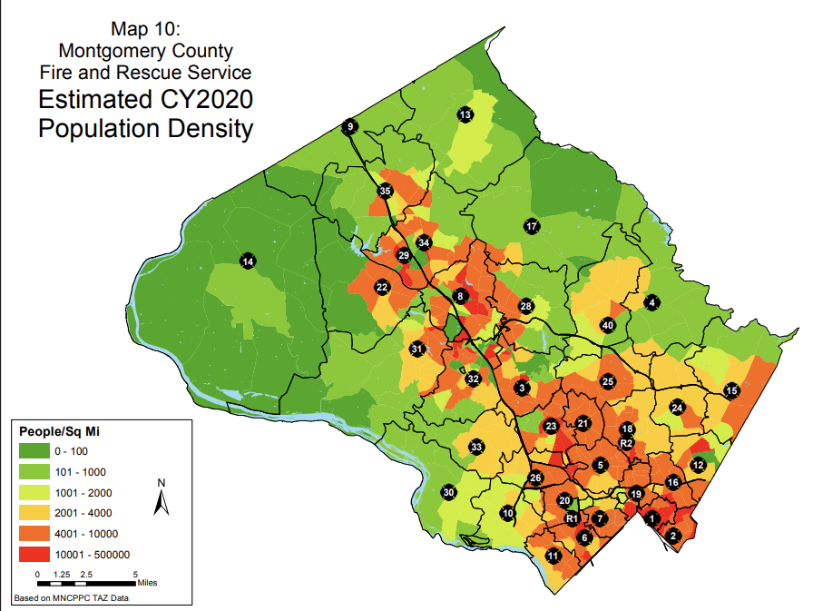
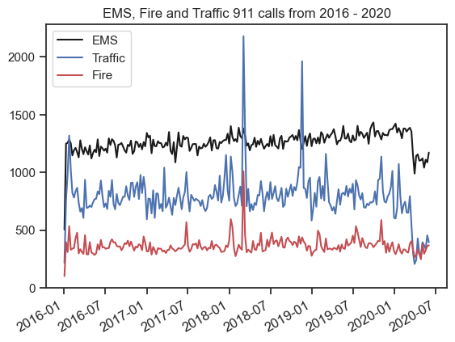
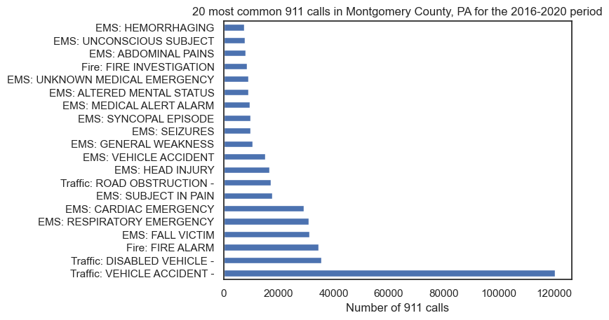
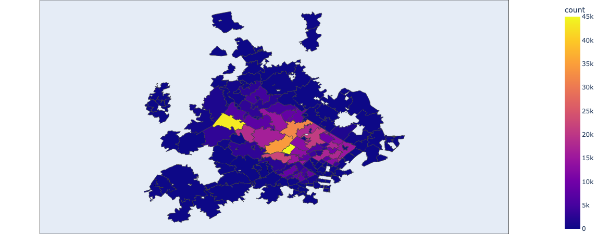

# Project of Data Visualization (COM-480)

| Student's name | SCIPER |
| -------------- | ------ |
| Linda Delacombaz | 288415 |
| Vincent Flattot | 352197 |
| Yann Cretton | 274709 |

# Milestone 1 

## The dataset

Have you ever heard about Montgomery County? 

We neither. But it is the most populous county of Maryland in the US. 

An other interesting fact about this place is that they have an open data policy about their **emergency services**. It enables curious student like us to dig in the emergency systems in a different dimension than just looking at basic stats on the news. 

To help us in this investigation, we found a dataset that gather **all emergency calls made between 2016 and mid 2020** [here](https://www.kaggle.com/datasets/mchirico/montcoalert).

This data set contains 663522 entries, with 9 columns for each 911 call in Montgomery County Pennsylvania.

It contains several information for each call, namely:

- Location of the call (latitude, longitude, address, township and zip code)

- Time of the call: it is the column `timeStamp` that has the year, month, day, hour, minute and second of the call.

- Description of the call that regroups the location and time along with the station name that took care of the call.

- Category of the call by the column `title`, that tells the information about the nature of the incident.

Also we were able to find revenues data thanks to [this website](https://www.unitedstateszipcodes.org/).

## The problematic

We all heard about the higher number of emergency calls made on the new year celebration because of champagne chorks, as [this article](https://www.nkytribune.com/2019/12/keven-moore-as-new-years-eve-celebration-looms-be-careful-of-those-flying-champagne-corks/) emphasizes. 

But have you ever wonder about the general impact of some specific events on the emergency services? 

With this project, our objective is to analyse **whether major US events such as 4th of July, Black Friday or even the Superball make the life of emergency service harder or easier**.

Also, we would like to study if some people's characteristics can influence their behaviour toward the emergency services. For example if cities with less revenues tend to call more often or less often.

We hope to bring a new way of looking at emergency services for lambda people. But it could also help decision-makers for future reflexion.

## Exploratory Data Analysis

You can find the full code and graphics of the EDA in this [notebook](/milestone_1.ipynb).

For our EDA, we followed some classical steps : 

### 1. Cleaning and Pre-processing

#### Duplicates 

- We dropped the duplicates on the `desc` column, since this column contains unique information (address, township, number of station, date and timestamp of the call (hour, minute and second)). There were less than 1% of duplicates.

#### Missing values

- We dropped the NaN values on the zip column, since this column contained crucial information to plot a map. It was the only column containing missing values, and 12 % of the total dataset.

#### Outliers

- We noticed by plotting a map that the region of the calls were extended outside of Montgomery county, PA. After checking the [official zip codes of Montgomery County, PA](https://www.ciclt.net/sn/clt/capitolimpact/gw_ziplist.aspx?FIPS=42091), we decided to filter out the zip codes beginning with 17-, as they are not considered to be inside the county.

- We then plotted the numbers of calls per year, and noticed that the 2015 year contained few values compared to the other. We decided thus to take the data frame from 2016 on. We also noticed that the number of calls dropped beginning of July 2020. We hence decided to filter these months out. Our timeframe is thus from 1st of January 2016 to end of June 2020.

#### Pre-processing

- In order to have a global vision of the data set, we created a column called `group`, which is the main category of each incident (`title` column). It contains three values : Emergency Medical Services (EMS), Fire and Traffic.

- We also create a column `year` that contains only the year of each call event.

### 2. Basic statistics and plots

After having our dataset cleaned and pre-processed, we performed some basic plots to gain more insights of the values.

#### Per category 

We first began to see what were the most common 911 calls category in the county :

We can observe that vehicle accidents caused by the traffic surpass the other kinds of calls by far, followed by disabled vehicle incidents.

#### Per regions

We also have zip codes, which can be useful to vizualize if there are hotspots of places where there are more calls than other.

We thus plotted an interactive map using [plotly express chloropleth function](https://plotly.com/python/choropleth-maps/#:~:text=A%20Choropleth%20Map%20is%20a,spatial%20variations%20of%20a%20quantity.) where you can hover over ever zip place and have the number of 911 calls over the 2016 - 2020 time period. 

You can find a snapshot of the map just below:

We can clearly see that there are indeed some zip code that have much more calls than the others.

## Related work
A lot of developpers have already been interested by this dataset. But they globally only focused on the data mining, rather than trying to make interesting visualization about those data.

Moreover, we truly think that our approach is original because to our knowledge, no one has already tried to link those emergency calls with major events. 

As inspiration, we first have the exercice session 5 with time series data. Also since we want to link each event to an amount of calls and compare between events, we like visualization such as the one used in NLP [example here](https://archive.nytimes.com/www.nytimes.com/interactive/2012/09/06/us/politics/convention-word-counts.html).
Finally, we would like to have some geographical visualization, hence we will use inspiration such as [this](https://gcp-us-east1.app.carto.com/map/697bdad6-3986-4bd8-9b7c-ad4ee4873953) nice map with interactivity 